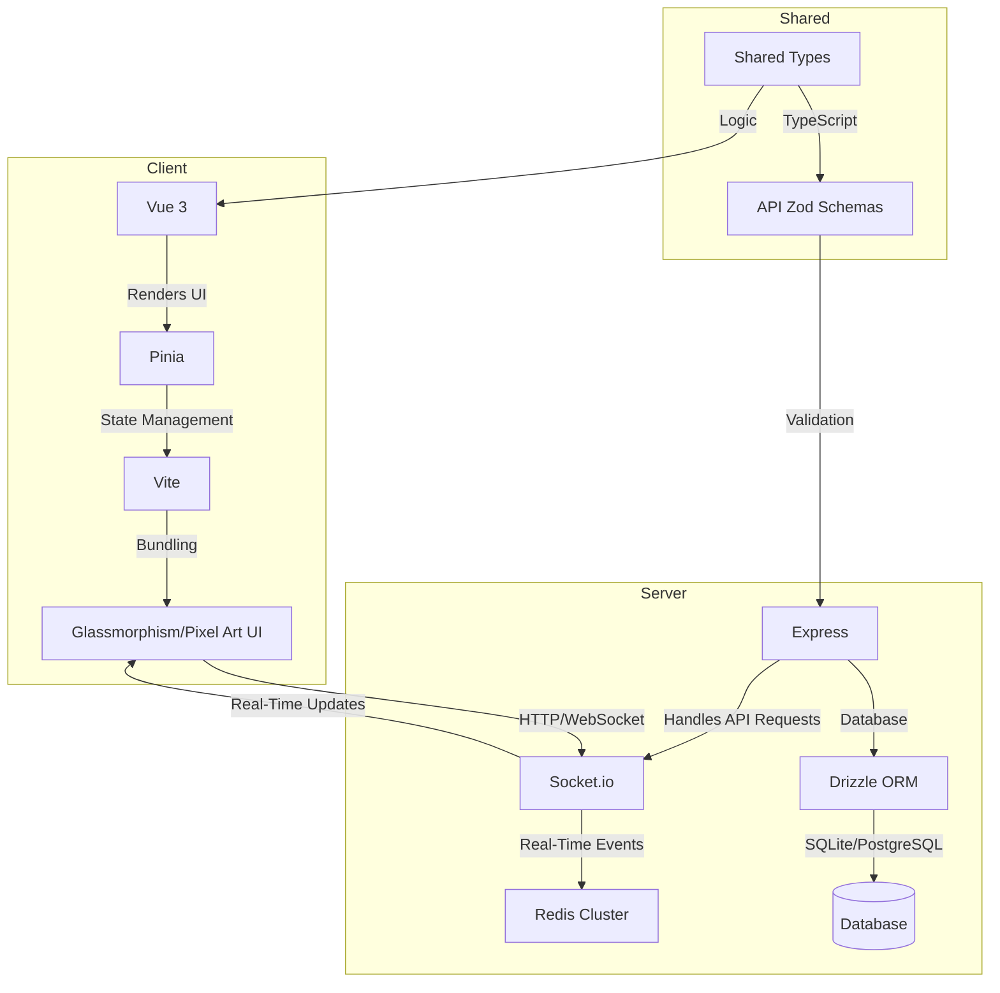
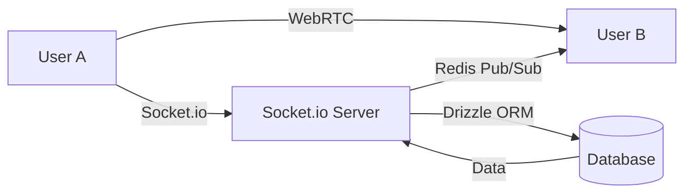

# 🌌 AetherPulse


**AetherPulse** is a cutting-edge, real-time communication and collaboration platform designed for seamless instant messaging, high-fidelity video calling, and immersive spatial audio. Built as a high-performance **TypeScript monorepo**, it combines a premium, responsive user interface with a robust, secure, and production-ready backend architecture.

---

## ✨ Key Features

| Feature                      | Description                                                                                        |
| ---------------------------- | -------------------------------------------------------------------------------------------------- |
| **🎙️ Spatial Audio & Video** | Next-gen WebRTC voice and video calls with localized spatial audio for natural team interactions.  |
| **💬 Real-Time Messaging**   | Fully-featured group rooms and direct messages with editing, soft-deletion, and typing indicators. |
| **🎨 Custom UI Themes**      | Fluid glassmorphism animations with dual UI paradigms: **Maximalist Aesthetic** and **Pixel Art**. |
| **🛡️ Enterprise Security**   | JWT session authentication, strict CORS, atomic database transactions, and rate-limiting guards.   |
| **⚡ Scalable Architecture** | Powered by **Turborepo**, **pnpm workspace**, and **Socket.io with Redis clustering**.             |

---

## 🏗️ Architecture Overview

### System Architecture Diagram



### Data Flow Diagram



---

## 📦 Project Structure

This project is a **monorepo** managed with [`pnpm`](https://pnpm.io/) and [`Turborepo`](https://turbo.build/repo).

```bash
aether-pulse/
├── client/               # Frontend (Vue 3, Pinia, Vite)
│   ├── src/
│   │   ├── assets/       # Static assets (images, fonts)
│   │   ├── components/   # Vue components
│   │   ├── stores/       # Pinia stores
│   │   ├── views/        # Pages/views
│   │   └── App.vue       # Root component
│   └── vite.config.ts    # Vite configuration
│
├── server/               # Backend (Node.js, Express, Socket.io)
│   ├── src/
│   │   ├── controllers/  # API controllers
│   │   ├── routes/       # Express routes
│   │   ├── sockets/      # Socket.io event handlers
│   │   └── app.ts        # Express app entry
│   └── package.json
│
├── shared/               # Shared logic, types, and database schema
│   ├── db/               # Drizzle ORM schema and migrations
│   ├── api-zod/          # Zod schemas for API validation
│   └── api-client-react/ # Generated API client
│
├── docs/                 # Documentation
├── scripts/              # Build and deploy scripts
├── docker/               # Docker configurations
│   ├── Dockerfile.client
   └── Dockerfile.server
│
├── .env.example          # Environment variables template
├── package.json          # Root package.json
├── pnpm-workspace.yaml   # pnpm workspace configuration
└── turbo.json            # Turborepo configuration
```

---

## 🚀 Getting Started

### Prerequisites

- [`pnpm`](https://pnpm.io/) (v10+)
- [`Node.js`](https://nodejs.org/) (v20+)
- [`Docker`](https://www.docker.com/) (optional, for containerized deployment)

---

### Installation

1. Clone the repository:

   ```bash
   git clone https://github.com/BoziaO/Aether-Pulse.git
   cd Aether-Pulse
   ```

2. Install dependencies:
   ```bash
   pnpm install
   ```

---

### Running the Project

#### Development Mode

Run both the client and server in development mode (this will also synchronize the local SQLite database schema):

```bash
pnpm dev
```

#### Individual Commands

- Start the client:
  ```bash
  pnpm start:client
  ```
- Start the server:
  ```bash
  pnpm start:server
  ```

---

### Database Setup

1. Copy the example environment file:

   ```bash
   cp .env.example .env
   ```

2. Run database migrations:
   ```bash
   pnpm --filter @workspace/db migrate
   ```

---

## 📦 Building for Production

To build the project for production:

```bash
pnpm build
```

---

## 🛡️ Security

AetherPulse is designed with security in mind:

- **JWT Authentication**: Secure session management.
- **Strict CORS**: Only trusted origins are allowed.
- **Rate Limiting**: Protects against abuse.
- **Input Validation**: Zod schemas for API validation.
- **Atomic Transactions**: Ensures data integrity.

---

## 🤝 Contributing

We welcome contributions! Please follow these steps:

1. Fork the repository.
2. Create a new branch (`git checkout -b feature/your-feature`).
3. Commit your changes (`git commit -m "feat: add your feature"`).
4. Push to the branch (`git push origin feature/your-feature`).
5. Open a **Pull Request**.

For detailed guidelines, see [`CONTRIBUTING.md`](CONTRIBUTING.md).

---

## 📜 License

This project is licensed under the **MIT License** – see the [`LICENSE`](LICENSE) file for details.

---

## 📞 Contact

For questions or feedback, please open an issue or contact the maintainers:

- **Maciej Łada** ([@BoziaO](https://github.com/BoziaO))
